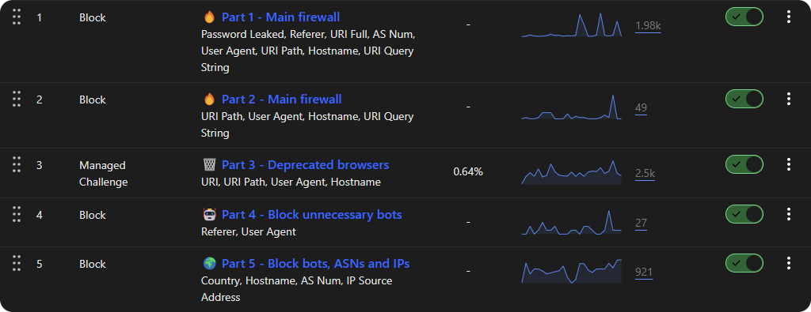

<div align="center"><h1>☁️ Cloudflare Web Application Firewall Rules</h1></div>

By using these WAF expressions, you can effectively block all unnecessary and potentially malicious requests targeting your origin server, thereby enhancing its security.
If you find this repository useful, I would greatly appreciate it if you could give it a **star** ⭐. Thank you!

> [!TIP]
> - Use a [dedicated script](#automatic-installation) to automatically update rules for each zone.
> - Do you want to report events from Cloudflare WAF to AbuseIPDB? See [Cloudflare-WAF-To-AbuseIPDB](https://github.com/sefinek/Cloudflare-WAF-To-AbuseIPDB).
> - Join my [Discord server](https://discord.gg/53DBjTuzgZ) if you need help or want to receive notifications about important updates.

 


## 🛡️ What Can This List Block?
| **Part**                                                                                                                                   | **Description**                                                                                                                | **Action**        |
|--------------------------------------------------------------------------------------------------------------------------------------------|--------------------------------------------------------------------------------------------------------------------------------|:------------------|
| $ **[Part 1](https://github.com/sefinek/Cloudflare-WAF-Expressions/blob/main/markdown/expressions.md#part1)<br>Main firewall (I)**         | Blocks data leaks, suspicious referrers, malicious and unusual URL paths, as well as empty or anomalous User-Agents.           | Block             |
| $ **[Part 2](https://github.com/sefinek/Cloudflare-WAF-Expressions/blob/main/markdown/expressions.md#part2)<br>Main firewall (II)**        | Blocks suspicious requests, exploits, path traversal, configuration file access attempts, and the use of CLI tools in URLs.    | Block             |
| $ **[Part 3](https://github.com/sefinek/Cloudflare-WAF-Expressions/blob/main/markdown/expressions.md#part3)<br>Deprecated browsers, etc.** | Enforces additional verification for outdated browsers, operating systems, and suspicious User-Agents.                         | Managed Challenge |
| $ **[Part 4](https://github.com/sefinek/Cloudflare-WAF-Expressions/blob/main/markdown/expressions.md#part4)<br>Block unnecessary bots**    | Blocks unnecessary, harmful bots, scanners, and web scrapers.                                                                  | Block             |
| $ **[Part 5](https://github.com/sefinek/Cloudflare-WAF-Expressions/blob/main/markdown/expressions.md#part5)<br>Block bots, ASNs and IPs**  | Blocks traffic from the Tor network, known malicious IP addresses, and autonomous systems (ASNs) linked to botnets or attacks. | Block             |

> [!IMPORTANT]  
> It is also recommended to **disable** the `Bot Fight Mode` feature in the `Security` tab.  
> Although this feature helps detect and block automated bot traffic, it can inadvertently block safe, legitimate bots as well, which is not our intention.

<div align="center">
   <h3>>> <a href="markdown/expressions.md">View Main Expressions</a> <<</h3>
   <h3>>> <a href="markdown/cache.md">View Expressions for Caching</a> <<</h3>
</div>


## ✅ Usage
### Automatic (highly recommended)<div id="automatic-installation"></div>
You can use the JavaScript code from this repository to automatically update the rules throughout the day.  
There's no need to add them manually, as the script takes care of everything for you (;

#### Requirements
1. [Node.js LTS + npm](https://nodejs.org)
2. [PM2](https://www.npmjs.com/package/pm2) (`npm i pm2 -g`)
3. [Git](https://git-scm.com/downloads)
4. Linux (also works on Windows Server)

#### Tutorial (for Linux)
1. Clone this repository:
   ```bash
   git clone https://github.com/sefinek/Cloudflare-WAF-Expressions.git cf-expressions
   ```
2. Install the necessary dependencies:
   ```bash
   cd cf-expressions && npm install
   ```
3. Copy the `.env.default` file and rename it to `.env`:
   ```bash
   cp .env.default .env
   ```
4. Open the `.env` file and configure the following variables:
   - Set `NODE_ENV` to `production`
   - Paste your Cloudflare token in place of `CF_API_TOKEN`
   - Set `PHP_SUPPORT` to `true` if your website uses PHP ([this will exclude .php blocking rules](https://github.com/sefinek/Cloudflare-WAF-Expressions/blob/main/markdown/expressions.md#%EF%B8%8F-firewall-rules-for-cloudflare-waf))
   ```bash
   nano .env
   ```
   
5. Run the script 24/7 using PM2:
   ```bash
   pm2 start && pm2 save
   ```
6. Configure PM2 to start on system boot:
   ```bash
   eval "$(pm2 startup | grep sudo)"
   ```

### Manually
1. Log in to your [Cloudflare](https://dash.cloudflare.com) account.
2. Select the domain where you want to add the expressions.
3. Click on the `Security` tab, then choose `WAF` from the dropdown menu.
4. In the `Custom rules` tab, click the `Create rule` button.
5. Copy the expressions from the [markdown/expressions.md](markdown/expressions.md) file.
6. Click `Edit expression` and paste the copied expressions.
7. Click `Deploy` to save the changes. Repeat this process for the remaining parts of the expressions, ensuring you select the appropriate action (Block or Managed Challenge) as specified in the file.
8. Done! The expressions are now active and will start blocking unwanted traffic to your origin server. Make sure your website functions correctly, and visit this repository periodically for the latest updates.


## 🔥 DDoS Protection (Additional Security Measures)
Cloudflare offers many settings that need to be configured manually according to your preferences.
In this tutorial, we will enable only those that will safeguard your server from DDoS attacks.
Keep in mind that there are many more measures available to mitigate DDoS attacks.

### 1: Creating DDoS L7 Ruleset
#### Security > DDoS > Deploy a DDoS override
1. **Override name:** DDoS L7 ruleset
2. **Ruleset action:** Block
3. **Ruleset sensitivity:** Default

### 2: Rate Limits
#### Security > Rate limiting rules > Create rule
1. **Rule name:** Default rate limit
2. Expression: `(starts_with(http.request.uri.path, "/"))`
   - **Field:** URI Path
   - **Operator:** starts with
   - **Value:** /
3. When rate exceeds…
   - **Requests:** 200 (you should adjust this value yourself based on your website's traffic)
   - **Period:** 10 seconds
4. Then take action…
   - **Choose action:** Block
5. For duration…
   - **Duration:** 10 seconds

### 3: Good to Know
1. Make sure that your server's IP address has not been leaked.
2. Your server should accept only requests coming from Cloudflare. Accessing your website directly, bypassing Cloudflare, should not be possible.
3. Configure rate limits on your server to reduce its load during a DDoS attack.


## 🤝 Pull requests
If you have any suggestions or improvements, feel free to open a [Pull request](https://github.com/sefinek/Cloudflare-WAF-Expressions/pulls).
Your contribution will be appreciated and will help keep this list up-to-date and effective in combating the latest threats. Thank you!


## 🔖 GNU GPL v3 License
Copyright © 2023–2025 [Sefinek](https://sefinek.net)

