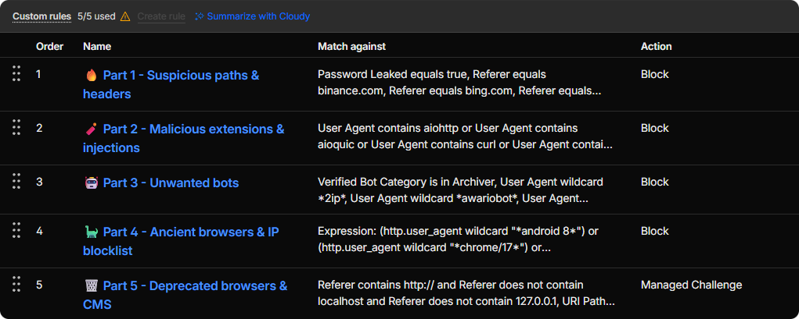
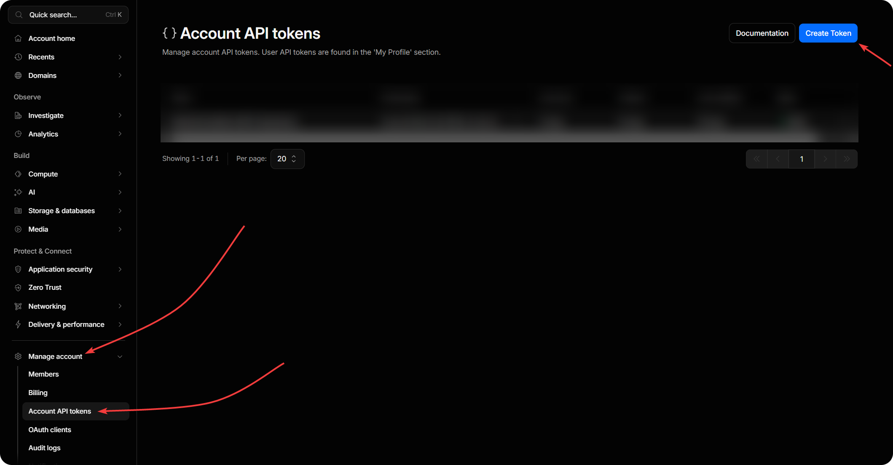
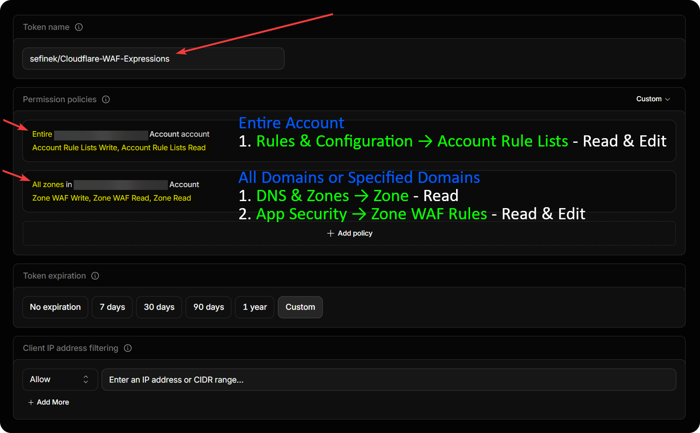
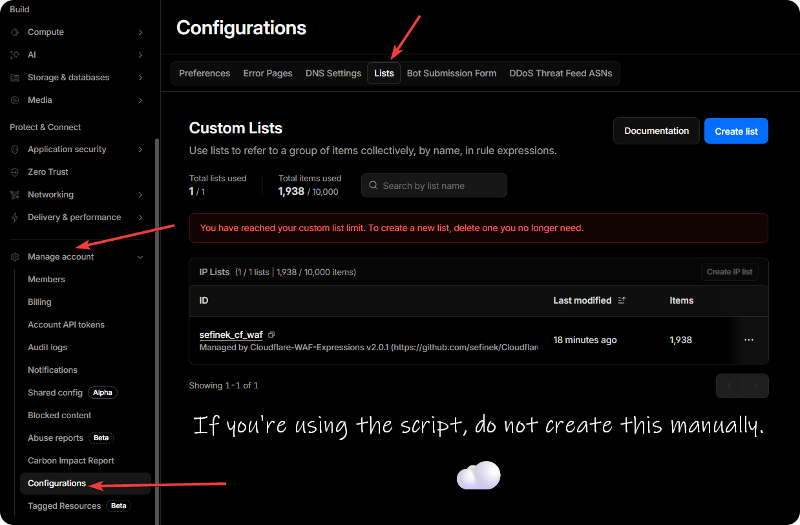

<div align="center"><h1>☁️ Cloudflare Web Application Firewall Rules</h1></div>

By using these WAF expressions, you can effectively block most unnecessary and potentially malicious requests targeting your origin server, thereby enhancing its security.
No Pro account or higher plan is required - everything works fine on the free Cloudflare plan.
If you find this repository useful, I would greatly appreciate it if you could give it a **star** ⭐. Thank you!

> [!TIP]
> - Use a [dedicated script](#automatic-installation) to automatically update rules for each zone.
> - Want to report Cloudflare WAF events to a public abuse database? See [Cloudflare-WAF-To-SniffCat](https://github.com/SniffCatDB/Cloudflare-WAF-To-SniffCat).
> - Join my [Discord server](https://discord.gg/53DBjTuzgZ) if you need help or want to receive notifications about important updates.

 


## 🐈 SniffCat integration
The script supports [SniffCat](https://sniffcat.com) - a service that provides a dynamic list of known malicious IP addresses.
When `SNIFFCAT_API_TOKEN` is set, the script fetches IPs from the SniffCat API on every sync and merges them with the static `rules/ip-blocklist.txt` before uploading to Cloudflare Lists.
This significantly extends the IP blocklist without any manual effort.

The integration can be controlled via two optional environment variables:
- `SNIFFCAT_CONFIDENCE_MIN` - minimum confidence level (0-100) required to include an IP. Default: `78`.
- `SNIFFCAT_LIMIT` - maximum number of IPs fetched per sync. Default: `3000`. Cloudflare allows up to 10,000 entries per list.

Without `SNIFFCAT_API_TOKEN`, the integration is skipped and only the static blocklist is used.


## 🛡️ What Can This List Block?
| Part (1-5)                                                                                                                                  | Description                                                                                                                 | Action            |
|---------------------------------------------------------------------------------------------------------------------------------------------|-----------------------------------------------------------------------------------------------------------------------------|:------------------|
| [🔥 Part 1 - Suspicious paths & headers](https://github.com/sefinek/Cloudflare-WAF-Expressions/blob/main/rules/expressions.md#part1)        | Blocks data leaks, suspicious referrers, malicious and unusual URL paths, as well as empty or anomalous User-Agents.        | Block             |
| [🧨 Part 2 - Malicious extensions & injections](https://github.com/sefinek/Cloudflare-WAF-Expressions/blob/main/rules/expressions.md#part2) | Blocks suspicious requests, exploits, path traversal, configuration file access attempts, and the use of CLI tools in URLs. | Block             |
| [🤖 Part 3 - Unwanted bots](https://github.com/sefinek/Cloudflare-WAF-Expressions/blob/main/rules/expressions.md#part3)                     | Blocks unnecessary, harmful bots, scanners, and web scrapers.                                                               | Block             |
| [🦕 Part 4 - Ancient browsers & IP blocklist](https://github.com/sefinek/Cloudflare-WAF-Expressions/blob/main/rules/expressions.md#part4)   | Blocks traffic from the Tor network, known malicious IP addresses, ASNs linked to botnets, and very outdated browsers.      | Block             |
| [🗑️ Part 5 - Deprecated browsers & CMS](https://github.com/sefinek/Cloudflare-WAF-Expressions/blob/main/rules/expressions.md#part5)        | Enforces additional verification for outdated browsers (Chrome 73-122, Firefox 62-118), old OS versions, and CMS scanners.  | Managed Challenge |

> [!IMPORTANT]  
> It is recommended to **disable** `Bot Fight Mode` in the `Security` tab.  
> Part 3 already controls which bots are blocked. Bot Fight Mode runs in parallel and may conflict with your rules.

<div align="center">
   <h3>>> <a href="rules/expressions.md">View Main Expressions</a> <<</h3>
   <h3>>> <a href="rules/cache.md">View Expressions for Caching</a> <<</h3>
</div>


## ✅ Usage
### Automatic (highly recommended)<div id="automatic-installation"></div>
You can use the JavaScript code from this repository to automatically update the rules throughout the day.  
There's no need to add them manually, as the script takes care of everything for you. 😉

#### Requirements
1. [Node.js LTS + npm](https://nodejs.org)
2. [PM2](https://www.npmjs.com/package/pm2) (`npm i pm2 -g`)
3. [Git](https://git-scm.com/downloads)
4. Linux (also works on Windows Server)

#### Tutorial (for Linux)
1. Clone this repository:
   ```bash
   git clone https://github.com/sefinek/Cloudflare-WAF-Expressions.git cf-expressions
   ```
2. Install the necessary dependencies:
   ```bash
   cd cf-expressions && npm install
   ```
3. Copy the `.env.example` file and rename it to `.env`:
   ```bash
   cp .env.example .env
   ```
4. Open the `.env` file and configure the following variables:
   - Set `NODE_ENV` to `production`
   - Paste your Account API token (Account → Manage account → Account API tokens) in place of `CF_API_TOKEN`. The token needs the following permissions:
     
     

> [!NOTE]
> Rules are deployed as WAF custom rules via the Rulesets API. The legacy Firewall Rules API was deprecated on 2025-06-15 and no longer accepts modifications. An old token may stop working if you use [User API Tokens](https://developers.cloudflare.com/fundamentals/api/get-started/create-token). Migrating to [Account API tokens](https://developers.cloudflare.com/fundamentals/api/get-started/account-owned-tokens) is highly recommended.

   - Set `CF_ACCOUNT_ID` to your Cloudflare Account ID (32 characters, found in the URL: `dash.cloudflare.com/<account_id>/configurations/lists`) - required for IP list synchronization
   - Set `CF_IP_BLOCKLIST_NAME` to a custom name for the managed IP list, or leave the default (`sefinek_cf_waf`)
     
   - Set `PHP_SUPPORT` to `true` if your website uses PHP (removes the Managed Challenge rule for `.php` files)
   - Set `WORDPRESS_SUPPORT` to `true` if your website runs WordPress (removes the Managed Challenge rules for `/wp-content` and `/wp-includes` paths so themes, plugins, CSS and images load correctly; also set `PHP_SUPPORT=true`)
   - Set `SNIFFCAT_API_TOKEN` to include dynamic malicious IPs from [SniffCat](https://sniffcat.com) (optional, but highly recommended)
   ```bash
   nano .env
   ```
5. Run the script 24/7 using PM2:
   ```bash
   pm2 start && pm2 save
   ```
6. Configure PM2 to start on system boot:
   ```bash
   eval "$(pm2 startup | grep sudo)"
   ```

### Manually
> [!CAUTION]
> This method is not recommended. WAF expressions and IP blocklists should be kept up to date at all times to remain effective against new threats. Updating them manually is error-prone and easy to forget. Use the [automatic method](#automatic-installation) instead.

1. Log in to your [Cloudflare](https://dash.cloudflare.com) account.
2. Select the domain where you want to add the expressions.
3. Click on the `Security` tab, then choose `WAF` from the dropdown menu.
4. In the `Custom rules` tab, click the `Create rule` button.
5. Copy the expressions from the [rules/expressions.md](rules/expressions.md) file.
6. Click `Edit expression` and paste the copied expressions.
7. Click `Deploy` to save the changes. Repeat this process for the remaining parts of the expressions, ensuring you select the appropriate action (Block or Managed Challenge) as specified in the file.
8. Done! The expressions are now active and will start blocking unwanted traffic to your origin server. Make sure your website functions correctly, and visit this repository periodically for the latest updates.

#### IP Blocklist (Part 4)
Part 4 references a Cloudflare Custom IP List (`ip.src in $sefinek_cf_waf`). To set it up manually:
1. Go to your Cloudflare dashboard and navigate to **Manage account > Configurations > Lists**.
2. Click **Create list**, set the **Identifier** to `sefinek_cf_waf` (cannot be changed later), and confirm.
3. Open the newly created list, add the IP addresses from [`rules/ip-blocklist.txt`](rules/ip-blocklist.txt), and save.
4. Part 4 will now block all IPs from that list.

> [!NOTE]
> On the free Cloudflare plan, you can have only 1 custom IP list per account (up to 10,000 entries). Paid plans allow more. Remember to update it regularly as new entries are added to [`rules/ip-blocklist.txt`](rules/ip-blocklist.txt). The automatic method handles this for you.


## 🗑️ Cleanup Tool
To remove all WAF custom rules and the IP blocklist from Cloudflare (e.g. before a fresh install), run:
```bash
node data/tools/deleteWAFRules.js
```
The script will list everything it found and ask for confirmation before deleting anything. It also clears the local rule ID cache (`data/rule-ids.json`).

> [!WARNING]
> This operation is irreversible! All custom WAF rules and the managed IP list will be permanently deleted from your Cloudflare account.


## 🤝 Pull requests
If you have any suggestions or improvements, feel free to open a [Pull request](https://github.com/sefinek/Cloudflare-WAF-Expressions/pulls).
Your contribution will be appreciated and will help keep this list up-to-date and effective in combating the latest threats. Thank you!


## 🔖 GNU GPL v3 License
Copyright © 2023-2026 [Sefinek](https://sefinek.net)

